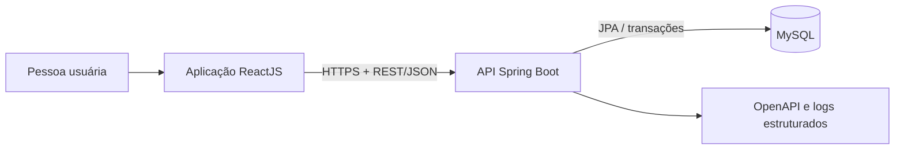
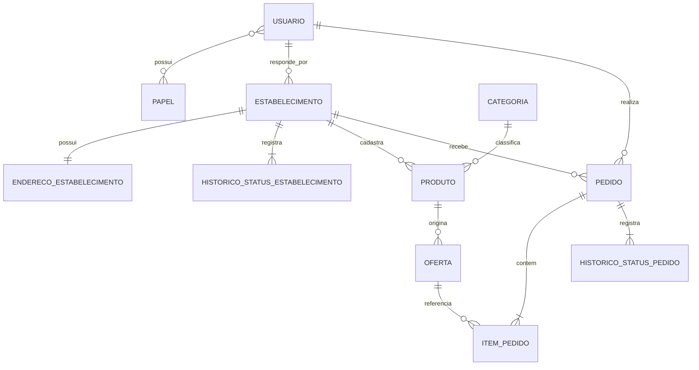

# Decisões do MVP e arquitetura

Este registro torna explícitas as escolhas que orientam o banco, a API e o frontend. Uma decisão poderá ser revisada, mas a mudança deverá registrar motivo e impacto.

## Resumo das decisões

| ID | Decisão | Justificativa | Consequência aceita |
|---|---|---|---|
| DEC-001 | MVP somente com retirada | Entrega exigiria endereço do cliente, taxa, cobertura, prazo e logística | Entrega permanece no backlog |
| DEC-002 | Conta e estabelecimento separados | Uma pessoa pode comprar e também administrar negócio sem duplicar conta | Permissões validam papel e propriedade |
| DEC-003 | Papéis cumulativos | Evita contas paralelas para a mesma pessoa | Relação N:N entre usuário e papel |
| DEC-004 | Um responsável por estabelecimento | Mantém a autorização simples no MVP | Múltiplos funcionários ficam para evolução futura |
| DEC-005 | Produto separado de oferta | Nome e descrição são estáveis; preço, estoque e período mudam | Uma tabela adicional melhora o histórico e permite novas ofertas |
| DEC-006 | Categorias globais | Evita duplicação e grafias inconsistentes | Somente administrador mantém categorias; nome normalizado e slug são únicos |
| DEC-007 | Carrinho no frontend | Reduz a complexidade inicial | Não haverá sincronização entre dispositivos |
| DEC-008 | Estoque descontado na criação | Regra simples e verificável para evitar venda acima do estoque | Cancelamento permitido precisa devolver estoque |
| DEC-009 | Total calculado no backend | O cliente não é fonte confiável de preço | Checkout sempre relê ofertas e recalcula valores |
| DEC-010 | Snapshot no pedido e nos itens | Alterações futuras não podem modificar o histórico | Preserva nome e preços dos itens, nome e endereço do estabelecimento, fuso e prazo de retirada |
| DEC-011 | Pagamento apenas declarado | O MVP prioriza catálogo, estoque, pedidos e retirada; integração financeira exigiria conciliação e novos fluxos | Não existe confirmação de recebimento no sistema |
| DEC-012 | Desativação lógica | Exclusão física pode quebrar histórico e auditoria | Consultas operacionais filtram registros inativos |
| DEC-013 | Monólito modular | É suficiente para o MVP e mais simples de executar e observar | Limites entre módulos devem ser respeitados no código |
| DEC-014 | Autodeclaração de maioridade | Atende à restrição com minimização de dados | Não é verificação documental de idade |
| DEC-015 | Busca local por cidade e bairro | Geolocalização adicionaria APIs, consentimento e cálculo de distância | O MVP não promete ofertas ordenadas por proximidade |
| DEC-016 | Primeiro cadastro por cliente autenticado | A solicitação precisa anteceder a concessão do papel de responsável | O solicitante acompanha, edita e reenvia o próprio cadastro por propriedade; `RESPONSAVEL` é concedido na primeira aprovação |
| DEC-017 | Uma oferta publicada ou pausada por produto | Evita condições comerciais concorrentes para o mesmo produto | Oferta encerrada é final; nova condição requer outra oferta |
| DEC-018 | Venda e retirada têm prazos separados | O encerramento das vendas não significa encerramento da retirada | O menor prazo de retirada entre os itens determina o prazo do pedido |
| DEC-019 | Idempotência persistida no pedido | Repetir a mesma requisição não deve gerar novo pedido ou desconto de estoque | Chave única por cliente e hash do payload distinguem repetição de uso indevido da chave |
| DEC-020 | Histórico de moderação do estabelecimento | Aprovação, rejeição e suspensão precisam ter rastreabilidade | Cada transição, incluindo a criação, gera registro em `HistoricoStatusEstabelecimento` |

## Arquitetura de contêineres



## Módulos previstos no backend

```text
backend
├── auth
├── usuarios
├── estabelecimentos
├── catalogo
├── pedidos
├── indicadores
└── shared
```

Cada módulo deverá organizar suas responsabilidades em controller, aplicação/serviço, domínio e infraestrutura. DTOs de entrada e saída não serão as próprias entidades JPA.

## Modelo conceitual preliminar



O diagrama é conceitual. Chaves, atributos, nulabilidade, índices e restrições serão definidos na Etapa 2.

## Cadastro e moderação do estabelecimento

Uma pessoa com papel `CLIENTE`, autenticada, pode solicitar seu primeiro estabelecimento. O campo de responsável é definido pela identidade autenticada e não por um identificador arbitrário enviado pelo frontend. A solicitação nasce em `PENDENTE_ANALISE`, vinculada ao solicitante; ele pode editar e acompanhar o próprio cadastro mesmo antes de receber o papel `RESPONSAVEL`.

| Estado atual | Próximo estado | Quem pode executar |
|---|---|---|
| Criação | `PENDENTE_ANALISE` | Cliente autenticado, como solicitante e proprietário |
| `PENDENTE_ANALISE` | `ATIVO` | Administrador, ao aprovar |
| `PENDENTE_ANALISE` | `REJEITADO` | Administrador, com motivo |
| `REJEITADO` | `PENDENTE_ANALISE` | Proprietário, após corrigir e reenviar |
| `ATIVO` | `SUSPENSO` | Administrador, com motivo |
| `SUSPENSO` | `ATIVO` | Administrador, ao reativar |
| `ATIVO` | `PENDENTE_ANALISE` | Proprietário altera endereço ou fuso e solicita nova análise |

A primeira aprovação concede `RESPONSAVEL` ao usuário, preservando seu papel `CLIENTE`. A autorização de operações sempre combina papel, propriedade do recurso e situação do estabelecimento; possuir o papel não concede acesso a negócios de outras pessoas. Todos os eventos da tabela são registrados em `HistoricoStatusEstabelecimento`, com estado anterior (ausente na criação), novo estado, ator, instante e motivo quando exigido. A alteração de estado e seu histórico são confirmados na mesma transação.

A suspensão impede novas vendas. Pedidos existentes continuam disponíveis para tratamento pelo responsável e acompanhamento pelo cliente, conforme suas regras de transição, para que a suspensão não bloqueie o cumprimento ou cancelamento de compromissos já registrados.

Endereço completo e fuso válido são obrigatórios antes da aprovação; toda decisão administrativa exige motivo. Mudança de endereço ou fuso exige nova análise e também preserva o tratamento dos pedidos existentes.

## Oferta, período de venda e retirada

Uma oferta nasce em `RASCUNHO`, pode seguir para `PUBLICADA` e alternar entre `PUBLICADA` e `PAUSADA`. Qualquer estado não terminal pode seguir para `ENCERRADA`, que é final. Não se reabre uma oferta encerrada. No máximo uma oferta de cada produto pode estar em `PUBLICADA` ou `PAUSADA`; essa exclusividade deverá resistir a requisições simultâneas.

Preço e prazos ficam imutáveis após a primeira publicação. Ajustes de saldo são transacionais; não sobrescrevem descontos concorrentes. Cancelamentos devolvem unidades à oferta original sem reabrir uma oferta encerrada ou expirada. `publicadaEm` registra a primeira publicação, e `concluidoEm` registra a conclusão única do pedido, sustentando os indicadores.

Os campos obedecem a `inicioVenda < vendaAte <= retiradaAte`. Uma nova venda exige oferta `PUBLICADA`, estoque suficiente e instante do servidor no intervalo `[inicioVenda, vendaAte)`: o início está incluído e o fim não. Produto, categoria e estabelecimento também precisam estar ativos. Encerrar o período de venda torna a oferta indisponível para novos pedidos independentemente de atualização agendada de status.

O fuso do estabelecimento usa identificador IANA, com padrão `America/Sao_Paulo`. Datas e horários são convertidos em instantes para comparação no servidor; a apresentação usa o fuso do estabelecimento. O prazo de retirada do pedido é o menor `retiradaAte` entre suas ofertas. Nome e endereço do estabelecimento, fuso e prazo de retirada são copiados para o pedido, e nome, preços e quantidades são copiados para os itens. Alterações posteriores no catálogo ou no estabelecimento não alteram esses registros históricos.

## Fluxo transacional de criação do pedido

Uma única transação deverá:

1. validar o cliente autenticado, a chave de idempotência e o payload;
2. consultar a chave no escopo do cliente: se já houver pedido com hash igual, retornar esse pedido; com hash diferente, responder `409 Conflict`;
3. validar que todas as ofertas pertencem ao mesmo estabelecimento;
4. bloquear as ofertas em ordem consistente;
5. confirmar estabelecimento, produto e categoria ativos, publicação, período de venda e estoque;
6. recalcular preços e totais no servidor e determinar o menor prazo de retirada;
7. descontar o estoque;
8. criar pedido e itens com os dados históricos, chave de idempotência e hash;
9. registrar o estado inicial `PENDENTE`;
10. confirmar tudo ou desfazer tudo.

Na Etapa 2 será avaliado bloqueio pessimista com `SELECT ... FOR UPDATE`. A combinação cliente e chave de idempotência terá unicidade no banco, e o hash será calculado a partir de representação consistente dos campos relevantes do payload. Uma consulta prévia não basta: se duas chamadas simultâneas disputarem a mesma chave, a transação que perder a disputa desfaz seus efeitos e retorna o pedido já confirmado, quando o hash coincidir, ou `409 Conflict` quando diferir. A repetição nunca desconta o estoque novamente.

## Fluxo transacional de cancelamento

O cancelamento deverá:

1. bloquear o pedido;
2. validar ator, propriedade e estado atual;
3. impedir uma segunda devolução de estoque;
4. devolver as quantidades quando permitido;
5. alterar o status para `CANCELADO`;
6. registrar histórico e motivo;
7. confirmar tudo ou desfazer tudo.

## Estratégia de segurança

- Spring Security para autenticação e autorização.
- JWT de curta duração para a API.
- Autorização por papel e pertencimento do recurso.
- BCrypt para senhas.
- Segredos fora do Git.
- Validação de entrada no servidor.
- Nenhum dado de cartão armazenado.
- Logs sem senha, token ou dado pessoal desnecessário.
- Administradores criados apenas por procedimento controlado.

No MVP, o token de acesso terá validade de 15 minutos e permanecerá somente na memória da aplicação, sem refresh token. Logout remove o token e dados privados da interface; ele não revoga imediatamente cópias do token no servidor, que permanecem válidas até expirar. Recarregar a página ou expirar o token exige novo login. Revogação imediata e renovação de sessão são evoluções futuras. Papel e pertencimento são validados no servidor em cada operação.

## Estratégia de evolução

As funcionalidades abaixo exigirão novas decisões antes de entrar no produto:

- múltiplos funcionários por estabelecimento;
- entrega e endereço do cliente;
- pagamento online;
- recuperação de senha por e-mail;
- geolocalização;
- sincronização de carrinho;
- avaliações, cupons e programa de fidelidade.
