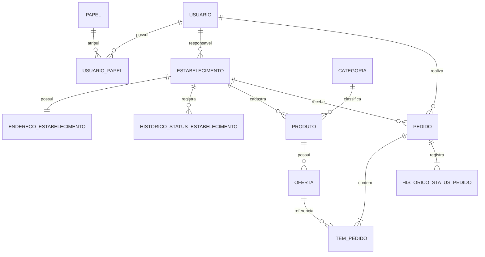

# Modelo de dados — Etapa 2

Este documento inicia a modelagem do MySQL para o MVP. O modelo representa pedidos para retirada e pagamento apenas declarado. Não haverá gateway, captura financeira, dados de cartão ou entidade `Pagamento` nesta etapa.

## Entidades do MVP

| Entidade | Responsabilidade | Observação |
|---|---|---|
| `usuario` | Conta de acesso e identidade da pessoa | Cadastro adulto; e-mail normalizado e único. |
| `papel` | Catálogo de papéis de autorização | `CLIENTE`, `RESPONSAVEL` e `ADMINISTRADOR`. |
| `usuario_papel` | Associação entre usuários e papéis | Permite papéis cumulativos sem duplicar contas. |
| `estabelecimento` | Negócio que publica ofertas | Possui um responsável e estado de moderação. |
| `endereco_estabelecimento` | Endereço e fuso do negócio | O fuso usa identificador IANA. |
| `historico_status_estabelecimento` | Auditoria da moderação | Registra criação, aprovação, rejeição, suspensão e reativação. |
| `categoria` | Classificação global do catálogo | Nome normalizado e slug únicos; desativação lógica. |
| `produto` | Item permanente do catálogo | Pertence a um estabelecimento e a uma categoria. |
| `oferta` | Condição comercial temporária | Controla preço, estoque, venda e retirada. |
| `pedido` | Compromisso de compra para retirada | Guarda snapshots do estabelecimento e a forma de pagamento declarada. |
| `item_pedido` | Snapshot dos itens comprados | Preserva nome, preços, quantidade e subtotal. |
| `historico_status_pedido` | Auditoria do pedido | Registra cada transição de status. |

## Relacionamentos

## Campos e restrições essenciais

### Identidade e estabelecimento

- Todas as tabelas terão chave primária `BIGINT` ou UUID definido antes da migration inicial.
- `usuario.email_normalizado` será único e comparado sem distinção entre maiúsculas e minúsculas.
- `usuario.maioridade_confirmada_em` será obrigatório no cadastro público.
- `usuario_papel` terá unicidade composta por usuário e papel.
- `estabelecimento.responsavel_id` será obrigatório e apontará para `usuario`.
- `estabelecimento.status` usará `PENDENTE_ANALISE`, `ATIVO`, `REJEITADO` ou `SUSPENSO`.
- `endereco_estabelecimento.fuso_iana` será obrigatório e terá `America/Sao_Paulo` como padrão inicial.
- Registros com histórico serão desativados logicamente, não apagados fisicamente.

### Catálogo e ofertas

- `categoria.nome_normalizado` e `categoria.slug` serão únicos.
- `produto` pertence a exatamente um estabelecimento e uma categoria.
- `oferta.preco_original` e `oferta.preco_oferta` serão decimais positivos.
- `oferta.preco_oferta <= oferta.preco_original`.
- `oferta.estoque_disponivel` será inteiro não negativo.
- A janela obedecerá `inicio_venda < venda_ate <= retirada_ate`.
- Datas serão persistidas em UTC e exibidas no fuso do estabelecimento.
- Apenas uma oferta de cada produto poderá estar `PUBLICADA` ou `PAUSADA`.
- Preços e prazos não serão alterados depois da primeira publicação; mudanças exigem nova oferta.

### Pedido e pagamento declarado

- `pedido.cliente_id` e `pedido.estabelecimento_id` serão obrigatórios.
- O pedido armazenará snapshots de nome, endereço, fuso e prazo máximo de retirada.
- `pedido.forma_pagamento_declarada` aceitará `PIX`, `DINHEIRO` ou `CARTAO_NA_RETIRADA`.
- A forma declarada não confirma pagamento e não cria transação financeira.
- O pedido terá `idempotency_key` e `payload_hash`, com unicidade composta por cliente e chave.
- `item_pedido` armazenará nome, preços, quantidade e subtotal do momento da criação.
- O total será calculado pelo backend a partir dos itens, nunca pelo frontend.
- O pedido seguirá `PENDENTE`, `CONFIRMADO`, `EM_PREPARO`, `PRONTO_PARA_RETIRADA`, `CONCLUIDO` ou `CANCELADO`.
- `concluido_em` será preenchido uma única vez ao entrar em `CONCLUIDO`.

## Ordem de criação das tabelas

1. `usuario`
2. `papel`
3. `usuario_papel`
4. `estabelecimento`
5. `endereco_estabelecimento`
6. `historico_status_estabelecimento`
7. `categoria`
8. `produto`
9. `oferta`
10. `pedido`
11. `item_pedido`
12. `historico_status_pedido`

## Fora do esquema do MVP

- `carrinho`: ficará temporariamente no frontend.
- `pagamento`: não haverá processamento financeiro.
- `endereco_cliente`: o pedido será retirado no estabelecimento.
- `funcionario_estabelecimento`: múltiplos funcionários ficam para evolução futura.

## Próximo entregável

Na sequência, este modelo será convertido em:

1. modelo lógico com nomes, tipos e nulabilidade;
2. diagrama físico com chaves e índices;
3. migration `V1__criar_schema_inicial.sql` do Flyway;
4. dados de demonstração sem informações pessoais reais;
5. consultas de verificação para estoque, idempotência e histórico.
